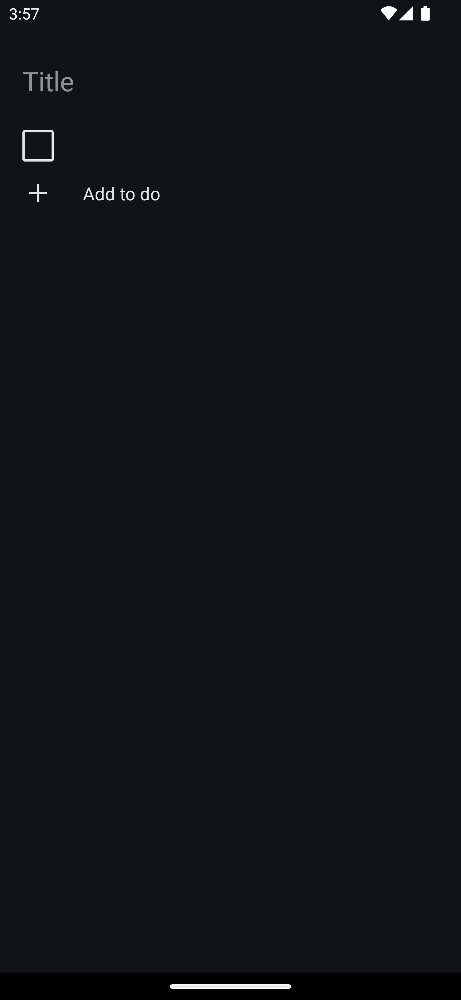
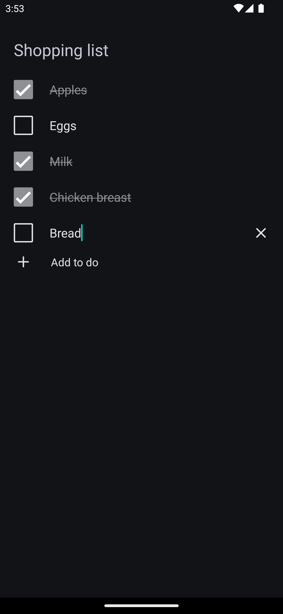

# ToDos

This is a simple ToDos application built with React Native and Expo. The application allows users to name the list with a title and add, remove, delete, and complete to-do entries. The data is saved to AsyncStorage to ensure persistence across app restarts.

## Screenshots

<p align="middle">
   
   
</p>

## Features

- List Title: The list has a customizable title.
- Add To-Do: Users can add new to-do items.
- Remove To-Do: Users can remove to-do items from the list.
- Complete To-Do: Users can mark to-do items as completed.
- Persistent Storage: To-do items and title are saved using AsyncStorage.

## Installation

To get started with the application, follow these steps:

1. Clone the repository:

   ```bash
   git clone https://github.com/rkonde/ToDos.git
   cd ToDos
   ```

2. Install dependencies

   ```bash
   npm install
   ```

3. Start the app

   ```bash
    npx expo start
   ```
